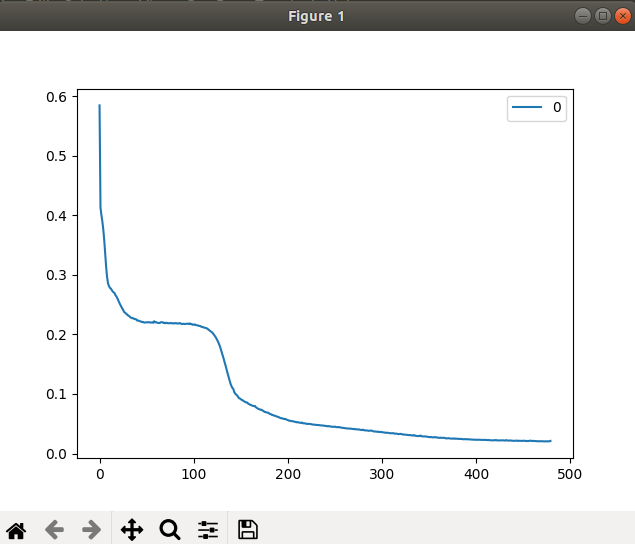
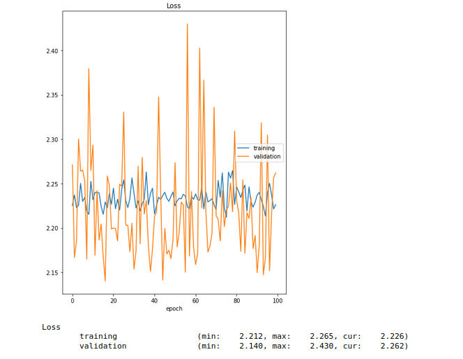
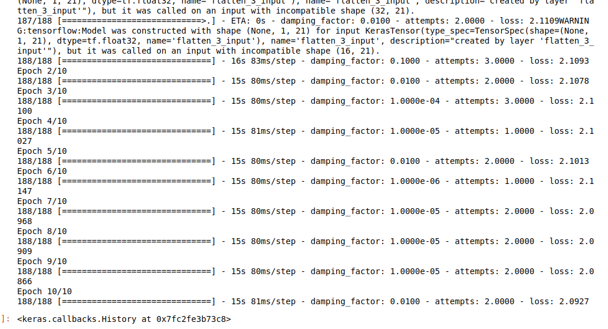

### README

--------------

_language: 中文_

#### 简介

本仓库受[参考文献1](Duka, Adrian-Vasile. "Neural network based inverse kinematics solution for trajectory tracking of a robotic arm." Procedia Technology 12 (2014): 20-27.),[参考文献2](Wang, Xiaoqi, et al. "Deep-learning damped least squares method for inverse kinematics of redundant robots." Measurement 171 (2021): 108821.)的启发尝试使用神经网络算法解决iiwa机器人的逆解问题

##### 文件树
  \* 
   |——README.md
   |——*.png
   |——Scripts
         |——data_treating.ipynb
         |——iiwa_dataset.csv
         |——iiwa_nn_ik_with_LM.ipynb

* data_treating.ipynb:处理数据的python代码
* iiwa_dataset.csv: 数据集
* iiwa_nn_ik_with_LM.ipynb:采用了LM算法后的NN模型. 

##### 依赖项
* tensorflow --version==2.6.2
* 第三方L-M算法库  [Github地址](https://github.com/fabiodimarco/tf-levenberg-marquardt)

##### 目前效果为:
1. 用上L-M算法后,Loss function的计算值仍未有下降的效果，Loss值维持在2.0附近
   

##### 讨论与反思
1. 曾经尝试使用sklearn中的模块对三连杆机器人采取神经网络的方式求其逆解,输入$[x,y,theta]$,theta为其姿态角,输出为$[j_1,j_2,j_3]$。这一次尝试是有效的,Loss function的计算值有在下降

   在该例子中甚至没有用上L-M算法作为其优化算法，从该次复现的经验来看，曾经的问题出在数据量少,未正则化上。

2. 吸取复现[参考文献1](Duka, Adrian-Vasile. "Neural network based inverse kinematics solution for trajectory tracking of a robotic arm." Procedia Technology 12 (2014): 20-27.)的经验后,增大了数据量。
   目前数据量为7500个,其中训练集合为6000个,而测试集为1500个
   
3. 尝试效果与说明如下:
   
   (1) 下图为采用Adam优化算法对输入数据进行求解的loss曲线
   
   
   说明: 训练数据为6000条，验证数据为1500条，此处valid_set就是test_set.
   
   网络采用的优化算法为:Adam
   
   层数为: 6层,每层共100个神经元
  
   激活函数: tanh
   
   损失函数: tensorflow内置的MSE函数，放入MSE函数作运算的两个计算值，y_predict与y_value为$[j_1,j_2,j_3,j_4,j_5,j_6]$
   
   _备注:iiwa机器人有七个关节，但最后一个关节仅影响机器人末端的姿态,故将其去除。_
   
   (2) 下图为采用了L-M优化算法后对输入数据进行求解的情况,总共进行了10回合的求解
   
   _由于并不熟悉如何自定义调用了第三优化器后输入loss曲线，故仅采取截图的方式_ :(
   
   说明: 训练数据为6000条，测试数据为1500条，但因为loss值一直未下降,在请教过实验室做深度学习的师兄后了解到,此即为没有训练到,因此测试集还未用上。
   
   网络采取的优化算法为:L-M算法
   
   层数:6层,每层共100个神经元
   
   激活函数: tanh
   
   损失函数: 第三方函数接口库中的MSE函数,由于MSE函数内部不熟悉故未知y_predict与y_value形式如何未知
   
4. 反思
   
   4.1 对tensorflow的接口不够熟悉导致模型搭建过程中有很多地方是不求甚解的
   4.2 针对此类回归问题,L-M算法是有力的,参见两份参考文献都使用了它，但是我对Jacobian矩阵,伪逆矩阵的性质不够熟悉，因此不明白L-M算法的工作原理。即使有相应的L-M第三函数接口可以调用但还是不明白其中出错在哪里。

   4.3  我仍然相信NN模型可以有效地解决这个逆解问题,理由如下:(1) NN模型本身可以应用于回归问题,见[L-M+NN完成sin函数的拟合的Github仓库示例代码](https://github.com/fabiodimarco/tf-levenberg-marquardt/blob/main/test_curve_fitting.py)，(2) 已有许多的文献完成过通过NN求解机器人逆解的问题
   
   4.4  我无意在深度学习上深挖，它仅是作为求解算法的一种。**目标仍将是解决这一从空间位置到关节空间映射的最优逼近问题。**
   
5.  下一步计划
   (1) 2022.01.08-2022.01.10 快速学习Jacobian矩阵与伪逆矩阵的性质，并在此基础上理解L-M算法与Damped-Least-Squared算法(参考文献2中提到的与LM算法一同使用的损失函数)
   (2) 2022.01-11-2022.01.13 复现参考文献2中的算法，该参考文献中的机器人模型为同款iiwa机器人,有极大的参考价值。
   
   

